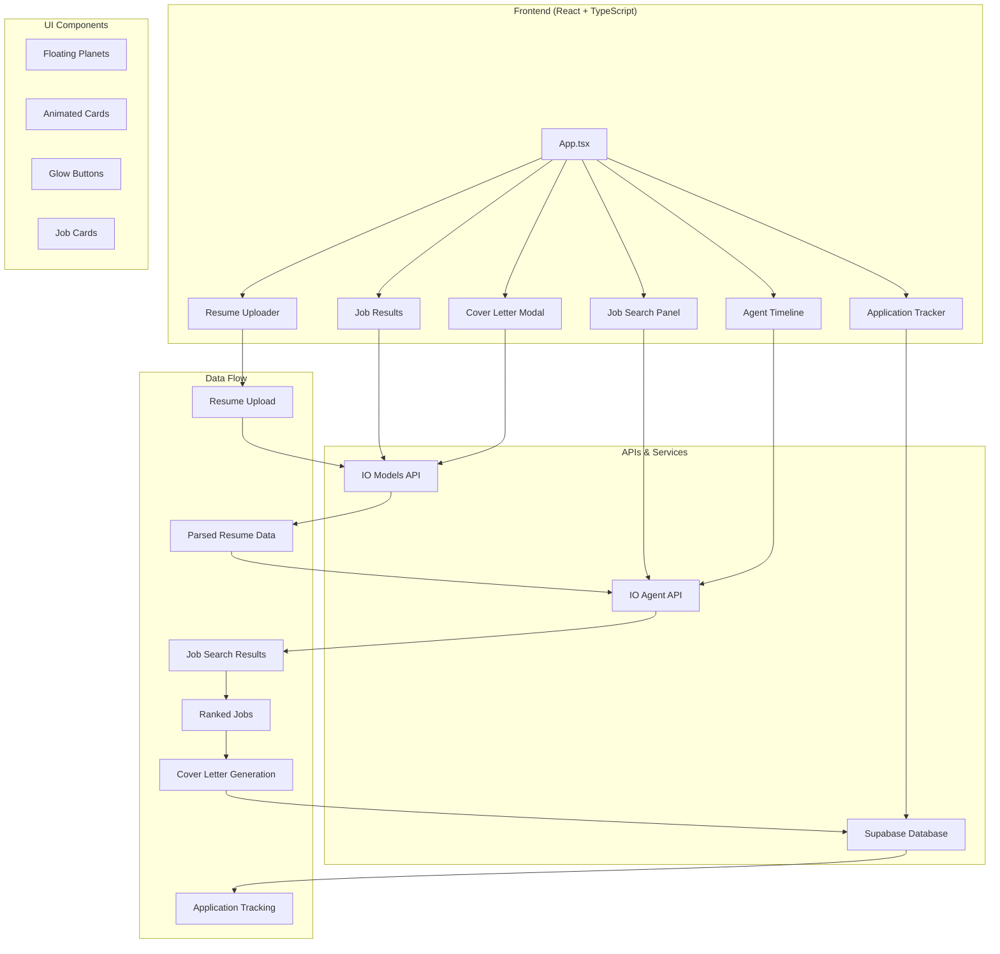
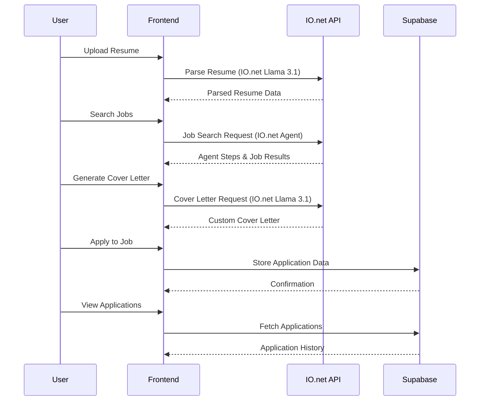

# 🚀 Smart Job Agent - AI-Powered Job Hunting Platform

A futuristic, space-themed AI agent that revolutionizes job hunting by scanning resumes, finding relevant jobs, generating custom cover letters, and tracking applications. Built for the Launch IO Hackathon.


## 🌟 Features

### 🤖 AI-Powered Job Matching
- **Resume Parsing**: Upload PDF, DOCX, or TXT files for intelligent parsing
- **Smart Job Search**: AI agent searches multiple job APIs and ranks by relevance
- **Relevance Scoring**: Advanced algorithm matches skills and experience
- **Real-time Agent Timeline**: Watch the AI agent work through each step

### ✍️ Intelligent Cover Letter Generation
- **Tailored Content**: Custom cover letters based on job description and resume
- **Customizable Options**: Choose tone (formal/friendly) and language (English/French)
- **Download & Copy**: Easy export options for immediate use

### 📊 Application Tracking
- **Comprehensive Tracking**: Monitor all job applications in one place
- **Status Updates**: Track progress from application to interview
- **Supabase Integration**: Secure cloud storage for application data

### 🎨 Stunning UI/UX
- **Space Theme**: Immersive dark interface with floating planets and stars
- **Smooth Animations**: Framer Motion powered transitions and micro-interactions
- **Responsive Design**: Perfect experience across all devices
- **Accessibility**: WCAG compliant with proper contrast ratios

## 🏗️ Architecture Overview



## 🗄️ Database Schema

### Applications Table
```sql
CREATE TABLE applications (
  id uuid PRIMARY KEY DEFAULT gen_random_uuid(),
  job_title text NOT NULL,
  company text NOT NULL,
  applied_date timestamptz DEFAULT now(),
  status text DEFAULT 'applied',
  job_url text,
  cover_letter text,
  notes text,
  created_at timestamptz DEFAULT now(),
  updated_at timestamptz DEFAULT now()
);
```

**Status Values:**
- `applied` - Initial application submitted
- `cover_letter_generated` - Custom cover letter created
- `company_viewed` - Company has viewed the application
- `interviewed` - Interview scheduled/completed
- `rejected` - Application rejected
- `accepted` - Job offer received

## 🔧 Tech Stack

### Frontend
- **React 18** with TypeScript for type safety
- **Tailwind CSS** for responsive styling
- **Framer Motion** for smooth animations
- **Lucide React** for consistent iconography

### Backend & APIs
- **IO.net API** - AI-powered resume parsing, job search, and cover letter generation using Llama 3.1 70B model
- **Supabase** - Database and real-time data management

### Development Tools
- **Vite** for fast development and building
- **ESLint** for code quality
- **TypeScript** for type safety

## 🚀 Getting Started

### Prerequisites
- Node.js 18+ and npm
- Supabase account
- IO Intelligence API keys

### Installation

1. **Clone the repository**
   ```bash
   git clone <repository-url>
   cd smart-job-agent
   ```

2. **Install dependencies**
   ```bash
   npm install
   ```

3. **Set up environment variables**
   Create a `.env` file with:
   ```env
    VITE_IO_INTELLIGENCE_API_KEY=your_api_key
    VITE_IO_NET_BASE_URL=https://api.intelligence.io.solutions/api/v1
    VITE_IO_MODEL_ID=any_model_name
    VITE_SUPABASE_URL=your_supabase_url
    VITE_SUPABASE_ANON_KEY=your_supabase_anon_key
   ```

4. **Set up Supabase database**
   - Create a new Supabase project
   - Run the migration file in `supabase/migrations/create_applications_table.sql`
   - Update your `.env` with Supabase credentials

5. **Start development server**
   ```bash
   npm run dev
   ```

## 📱 User Journey



## 🎯 Key Features Breakdown

### 1. Resume Upload & Parsing
- **File Support**: PDF, DOCX, TXT formats
- **Drag & Drop**: Intuitive file upload interface
- **AI Parsing**: Extracts skills, experience, education, and interests
- **Validation**: Error handling for unsupported formats

### 2. Smart Job Search
- **Multi-API Integration**: Searches Indeed, LinkedIn, and other job boards
- **AI Ranking**: Relevance scoring based on resume match
- **Real-time Updates**: Live agent timeline showing search progress
- **Location Filtering**: Optional location-based job filtering

### 3. Cover Letter Generation
- **AI-Powered**: Tailored content based on job description and resume
- **Customization**: Multiple tone and language options
- **Export Options**: Download as text file or copy to clipboard
- **Regeneration**: Modify parameters and regenerate instantly

### 4. Application Tracking
- **Status Management**: Track application progress through hiring pipeline
- **Data Persistence**: Secure cloud storage with Supabase
- **Timeline View**: Chronological application history
- **Quick Actions**: Direct links to job postings

## 🎨 Design System

### Color Palette
- **Primary**: Neon Blue (#00bfff)
- **Secondary**: Purple (#6a0dad)
- **Accent**: Mint Green (#00ffcc)
- **Background**: Pure Black (#000000)
- **Text**: White (#ffffff) and Gray variants

### Typography
- **Headings**: Bold, gradient text effects
- **Body**: Clean, readable fonts with proper line spacing
- **Code**: Monospace fonts for technical content

### Animations
- **Page Transitions**: Smooth fade and slide effects
- **Micro-interactions**: Hover states and button feedback
- **Loading States**: Engaging progress indicators
- **Background**: Floating planets and particle effects

## 🔒 Security & Privacy

- **API Key Management**: Secure environment variable handling
- **Data Encryption**: Supabase handles data encryption at rest
- **Row Level Security**: Database policies for data protection
- **Input Validation**: Client and server-side validation

## 🚀 Deployment

### Build for Production
```bash
npm run build
```

### Deploy to Netlify/Vercel
1. Connect your repository
2. Set environment variables
3. Deploy with automatic builds

## 🤝 Contributing

1. Fork the repository
2. Create a feature branch
3. Make your changes
4. Add tests if applicable
5. Submit a pull request

## 📄 License

This project is licensed under the MIT License - see the LICENSE file for details.

## 🙏 Acknowledgments

- **IO.net** for providing the decentralized AI infrastructure and Llama 3.1 70B model access
- **Supabase** for the backend infrastructure
- **Launch IO Hackathon** for the inspiration
- **Framer Motion** for smooth animations
- **Tailwind CSS** for the styling system

---

Built with ❤️ for the Launch IO Hackathon